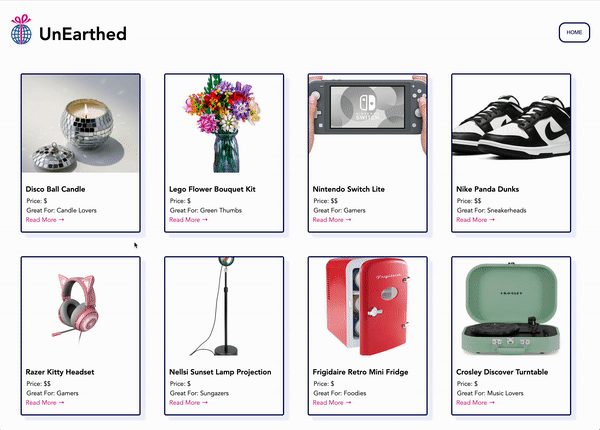

# Lab 2: Unearthed Part 2 Exemplar

## Overview

In the second part of this lab, students will create a Postgres database to hook up to the Unearthed app they created in the previous lab. They will also refactor their frontend code to accept information from the database rather than the JSON file.

## Project Screenshot



## Setup

### Dependencies

* [Express](https://expressjs.com/)
* [PostgreSQL](https://www.npmjs.com/package/pg)
* [Nodemon](https://www.npmjs.com/package/nodemon)

---

### Install Dependencies

Before installing dependencies, you will need `node` and `npm` installed globally on your machine by installing  [NodeJS](https://nodejs.org/en/download/) onto your machine.

To install the dependencies, run:

```sh
npm install
```

Alternatively, you can install the dependencies individually:

```sh
npm install express
npm install nodemon
npm install pg
```

---

### Run UnEarthed Part 2

In the repo directory, run the following in your terminal:

```sh
npm run dev

```

Visit the web application in the browser:

```html
http://localhost:3000/
```

---

*Last Updated: March 2023*